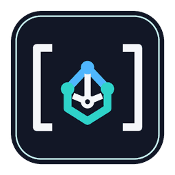

<p align="center">
  
</p>

<h1 align="center">Matrix Extended для Home Assistant</h1>

<p align="center">Безопасный двусторонний Matrix-канал для Home Assistant: E2EE, медиа, notify-сущности, входящие события, реакции, голос, геопозиция и устойчивая доставка.</p>

<p align="center"><a href="README.md">English</a> · <a href="README.ru.md"><strong>Русский</strong></a></p>

<p align="center">
  
  
  
  
  
</p>

<p align="center"><sub>Разработка, тестирование и документация выполняются с помощью ИИ OpenAI / ChatGPT. Решения по проекту и сопровождение остаются за <a href="https://github.com/Psix-anp">Psix-anp</a>.</sub></p>

## Возможности

- Сквозное шифрование текста и медиа с постоянным crypto-state.
- Основная `notify`-сущность и отдельные `notify.*` сущности комнат.
- Графический редактор действий Home Assistant: аккаунт, Media Browser, TTS/STT, язык, location, reaction actions и параметры сообщений.
- Home Assistant Media Browser: Local Media, Frigate и другие Media Source providers.
- Текст, notice, emote, Markdown/HTML, mentions, threads, replies, reactions, edits и redactions.
- Обновляемые уведомления через `notification_key`.
- Входящие message, reply, reaction, media, location, edit и redaction события.
- Home Assistant TTS → Matrix voice, Matrix voice → Home Assistant STT и опциональный автоматический Voice Assist.
- Безопасные заранее зарегистрированные Matrix-команды для действий Home Assistant и снимков камер.
- Persistent outbox при временной недоступности Matrix.
- Полноценные русские и английские интерфейс и документация.

## Установка

### Обычная установка через HACS

После принятия Matrix Extended в основной каталог HACS откройте **HACS → Интеграции**, найдите **Matrix Extended**, установите интеграцию и перезапустите Home Assistant.

### HACS как пользовательский репозиторий

Пока заявка в основной каталог HACS проходит проверку, публичный репозиторий можно добавить напрямую:

1. Откройте **HACS → Интеграции**.
2. Откройте меню HACS и выберите **Пользовательские репозитории**.
3. Добавьте `https://github.com/Psix-anp/matrix-extended` с типом **Integration**.
4. Найдите **Matrix Extended** и установите её.
5. Перезапустите Home Assistant.

HACS устанавливает интеграцию в `/config/custom_components/matrix_extended`.

### Установка вручную

Скачайте install ZIP из последнего GitHub Release, распакуйте `custom_components/matrix_extended` в `/config/custom_components/matrix_extended` и перезапустите Home Assistant. Для обычной установки лучше использовать проверенный release-архив, а не произвольный snapshot ветки разработки.

## Первое подключение

После установки и перезапуска Home Assistant:

1. Откройте **Настройки → Устройства и службы → Добавить интеграцию**.
2. Найдите **Matrix Extended**.
3. Заполните форму подключения:
   - **Homeserver (`homeserver`)** — базовый URL Matrix Client API, например `https://matrix.example.org`.
   - **Matrix ID (`user_id`)** — полный ID, например `@homeassistant:example.org`.
   - **Пароль** — используется только для первого входа в Matrix. Интеграция получает по нему access token; сам пароль Matrix Extended не сохраняет.
   - **Комната по умолчанию (`default_room`)** — Room ID вида `!abc:example.org` или alias вида `#home:example.org`. Alias проверяется и разрешается при подключении.
   - **Проверять TLS (`verify_ssl`)** — для обычного HTTPS оставляйте включённым. Отключайте только для сознательно доверенного локального/тестового homeserver.
   - **Требовать E2EE (`require_e2ee`)** — включено по умолчанию. При включённой опции отправка в незашифрованные комнаты блокируется.
   - **Входящие события (`incoming_enabled`)** — включены по умолчанию.
   - **Разрешённые пользователи (`allowed_users`)** — кто может отправлять события в Home Assistant. Если поле пустое при первом подключении, используется ваш текущий Matrix ID.
   - **Разрешённые комнаты (`allowed_rooms`)** — откуда Home Assistant принимает события. Если поле пустое при первом подключении, используется комната по умолчанию.
   - **Скачивать входящие медиа (`download_incoming_media`)** — включает локальное скачивание/расшифровку вложений и voice для автоматизаций.
4. Сохраните форму. Matrix Extended выполнит login, проверит/разрешит комнату, сохранит access token и device ID и создаст постоянное E2EE-состояние.
5. Откройте устройство Matrix Extended и убедитесь, что диагностическая сущность соединения стала подключённой.

Для любой входящей автоматизации одновременно должны пройти **оба** allowlist: отправитель и комната. Это fail-closed поведение.

## Настройка после подключения

Откройте **Настройки → Устройства и службы → Matrix Extended → Настроить**. В меню пять разделов:

- **Основные** — комната по умолчанию, проверка TLS и требование E2EE.
- **Входящие и безопасность** — включение входящих событий и allowlist пользователей/комнат.
- **Входящие медиа** — скачивание, срок хранения и лимит занимаемого места.
- **Voice Assist** — автоматический Matrix voice → STT → Home Assistant Assist, режим ответа (`text`, `voice` или `both`), STT/TTS сущности, язык, conversation agent и дополнительные доверенные пользователи/комнаты.
- **Маршруты уведомлений** — графическое добавление, изменение и удаление именованных групп комнат без JSON.

Также интеграция создаёт select-сущность **Комната по умолчанию** со списком joined rooms.

Полное описание: [Настройка и подключение](docs/SETTINGS.ru.md).

## Действия и автоматизации

Основной способ — графический редактор действий Home Assistant. YAML полностью поддерживается через **Редактировать в YAML**.

Текущие действия:

- `matrix_extended.send`
- `matrix_extended.send_media`
- `matrix_extended.send_voice`
- `matrix_extended.transcribe_voice`
- `matrix_extended.send_location`
- `matrix_extended.reply`
- `matrix_extended.react`
- `matrix_extended.edit`
- `matrix_extended.redact`
- `matrix_extended.purge_media`
- `matrix_extended.register_command`
- `matrix_extended.unregister_command`

Все поля, defaults, ограничения и response data: [Действия и события](docs/ACTIONS.ru.md). Готовые копируемые автоматизации, включая оба режима safe commands и Matrix voice → STT/Assist: [Практические примеры](docs/EXAMPLES.ru.md).

## Media Browser

`matrix_extended.send_media` открывает штатный Home Assistant Media Browser и принимает provider-specific типы. Если Frigate, Local Media или другой Media Source provider показывает клип/снимок/файл в Home Assistant, его можно выбрать графически.

Для камер, URL, локальных путей, нескольких вложений, thumbnail и ручных metadata используйте `media` в `matrix_extended.send`.

## Безопасность входящих событий

Обработка fail-closed: при включённых входящих событиях **и отправитель, и комната** обязаны совпасть с allowlist. Собственные transaction echoes игнорируются.

Reaction actions и безопасные Matrix-команды содержат заранее сохранённые действия. Входящий Matrix-текст никогда не выполняется как произвольный YAML/Jinja Home Assistant и не может выбрать произвольный service.

Автоматический Voice Assist выключен по умолчанию и имеет дополнительные ограничения по доверенным пользователям/комнатам. Включайте его только там, где участникам действительно разрешено отдавать команды Assist.

## Диагностика и хранилище

Устройство интеграции показывает соединение, Matrix user/device ID, комнату по умолчанию и её шифрование, последнюю успешную отправку, последнее входящее событие, последнюю ошибку, состояние safe commands и доставки.

Скачанные входящие медиа каждого config entry хранятся отдельно:

```text
/config/matrix_extended/incoming/<config_entry_id>/
```

E2EE crypto-state и внутренние реестры интеграции хранятся в Home Assistant storage. Не редактируйте их вручную при работающем Home Assistant.

## Проверка релиза

Release проходит regression suite и реальный стек **Home Assistant 2026.9.2 + Synapse 1.160.0 + Element Web 1.12.26**. CI проверяет E2EE dependencies, парсинг `services.yaml` самим Home Assistant, encrypted send/decrypt, notify entities, Media Browser send, safe commands, автоматический Voice Assist, outage/reconnect, перезапуск HA, отсутствие утечек фоновых задач и целостность install ZIP.

Для публичного распространения дополнительно запускаются HACS validation и Home Assistant Hassfest.

Подробнее: [Тестирование](docs/TESTING.ru.md). История релизов: [CHANGELOG.ru.md](CHANGELOG.ru.md). Авторство и сопровождение: [AUTHORS.md](AUTHORS.md).

## Лицензия

MIT — см. [LICENSE](LICENSE).
